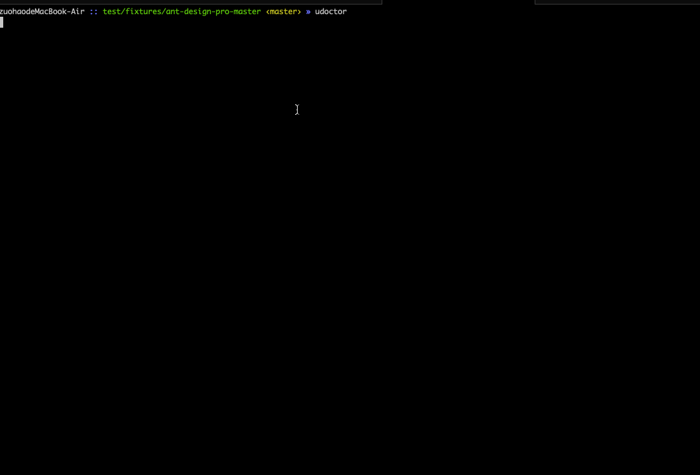

# umi-locale-doctor

[![NPM Version][npm-image]][npm-url]
[![Build Status][travis-image]][travis-url]
[![Coverage Status][coverage-image]][coverage-url]
![][david-url]
![][dt-url]
![][license-url]

A useful tool to analyze [umi-locale-usage](https://umijs.org/api/#locale):

- keys are miss defined in locales
- keys are never used in source code

See below:



## Install

```bash
npm i -g umi-locale-doctor
```

## Usage

Execute `udoctor` at the root dir of your `umi` based repo.

```bash
udoctor
```

## LICENSE

[MIT License](https://raw.githubusercontent.com/leftstick/umi-locale-doctor/master/LICENSE)

[npm-url]: https://npmjs.org/package/umi-locale-doctor
[npm-image]: https://badge.fury.io/js/umi-locale-doctor.png
[david-url]: https://david-dm.org/leftstick/umi-locale-doctor.png
[travis-image]: https://api.travis-ci.com/leftstick/umi-locale-doctor.svg?branch=master
[travis-url]: https://travis-ci.com/leftstick/umi-locale-doctor
[coverage-image]: https://coveralls.io/repos/github/leftstick/umi-locale-doctor/badge.svg?branch=master
[coverage-url]: https://coveralls.io/github/leftstick/umi-locale-doctor
[dt-url]: https://img.shields.io/npm/dt/umi-locale-doctor.svg
[license-url]: https://img.shields.io/github/license/leftstick/umi-locale-doctor
